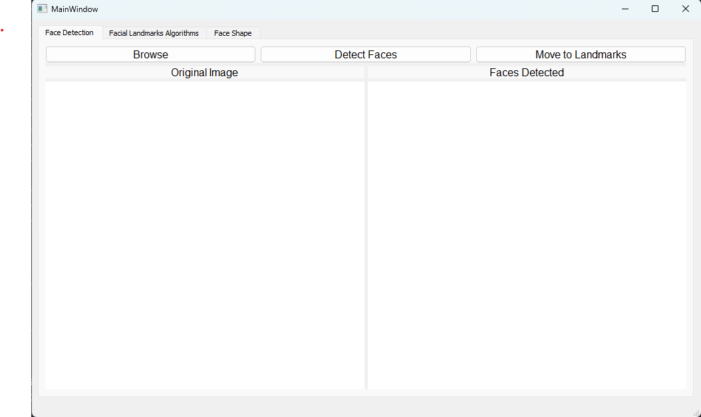

# Conventional-Face-Classification-with-Facial-Landmarks

A project that uses conventional methods to classify different face shapes based on facial landmarks. This project aims to identify an individual's face shape by analyzing their facial landmarks without using machine learning techniques.

## Dataset

The dataset used in this project includes images of different individuals with different face shapes. The facial landmarks were extracted using the dlib library. The dataset was preprocessed to extract the facial landmarks and stored in CSV format for further processing.

<a href="https://www.kaggle.com/datasets/niten19/face-shape-dataset">Dataset_on_kaggle</a>

## Implementation

The classification algorithm used in this project is a rule-based algorithm that classifies the face shape based on the ratios of the extracted facial landmarks. The algorithm classifies the face shape into one of five categories: oval, round, square, oblong, and heart. The implementation of the algorithm is done in Python.

## Usage

To use this project, clone the repository and install the required dependencies. The project requires Python 3.x and the following packages: <strong>NumPy</strong>, <strong>Pandas</strong>, <strong>dlib</strong>, <strong>Qt5</strong>, <strong>opencv</strong>, and <strong>Matplotlib</strong>.

## Conclusion

Overall, this project showcases the potential of using conventional methods for face shape classification using facial landmarks. It provides a valuable resource for researchers and developers interested in exploring different approaches to face recognition and classification.

## Our Research Paper

<a href="https://drive.google.com/file/d/1SLyu3W7sT5kIFkcTbTb8AZeGnBjvsCHl/view">Research_paper</a>

## Application Demo

